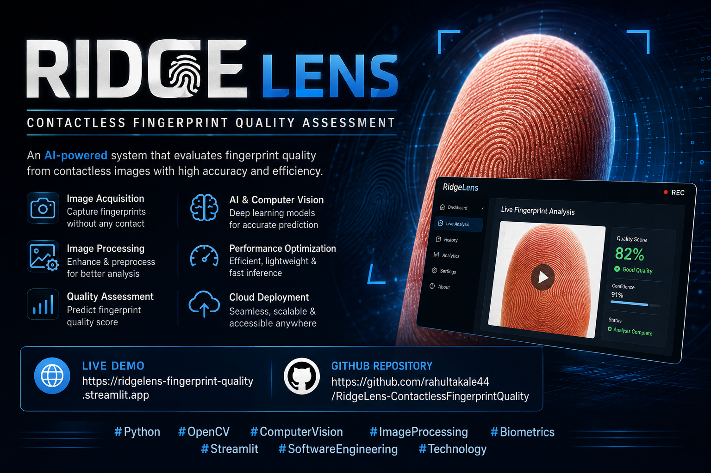

<div align="center">

<p align="center">
  
</p>
</div>

# RidgeLens
### Contactless Fingerprint Quality Assessment & Capture Guidance

A fast, explainable, and configurable computer-vision system that evaluates
mobile-camera fingerprint captures before biometric processing.

<br>

[](https://ridgelens-fingerprint-quality.streamlit.app)
[](https://www.python.org/)
[](https://opencv.org/)
[](https://streamlit.io/)
[](#automated-testing)
[](https://ridgelens-fingerprint-quality.streamlit.app)

<br>

**Built by [Rahul Takale](https://github.com/rahultakale44)**

</div>

---

## 🌐 Live Application

The deployed RidgeLens application is available here:

### [Launch RidgeLens](https://ridgelens-fingerprint-quality.streamlit.app)

The application supports:

- Fingerprint-image upload
- Live camera capture
- Adjustable quality thresholds
- Finger-region detection
- Ridge-clarity analysis
- Diagnostic visualizations
- Performance monitoring
- JSON assessment export

---

## Overview

RidgeLens is a contactless fingerprint image-quality assessment system.

It evaluates whether a fingerprint photograph captured through a mobile camera
is suitable for downstream biometric processing.

The project does not perform fingerprint matching or identity recognition.
Instead, it acts as a quality gate before feature extraction, template
generation, or biometric matching.

```text
Mobile Camera / Image Upload
              │
              ▼
     RidgeLens Quality Gate
              │
       ┌──────┴──────┐
       │             │
       ▼             ▼
     READY         RETAKE
       │             │
       ▼             ▼
 Biometric       Recapture
 Processing       Guidance
````

Poor-quality contactless fingerprint images may contain:

* Motion blur
* Incorrect exposure
* Strong glare
* Incomplete fingertip coverage
* Weak or invisible ridge structure
* Distracting background regions

RidgeLens detects these problems and provides an explainable decision with
actionable recapture guidance.

---

##  Core Features

### Image capture

* Upload JPG, JPEG, PNG, or BMP fingerprint images
* Capture fingertip photographs using a webcam or mobile camera
* Validate empty, corrupted, unsupported, and missing inputs
* Limit uploads to 10 MB in the deployed application

### Image preprocessing

* Aspect-ratio-preserving resizing
* Maximum working resolution of 640 × 640
* BGR-to-grayscale conversion
* CLAHE-based local contrast enhancement
* Original and processed image metadata

### Quality assessment

RidgeLens evaluates five quality dimensions:

1. Sharpness
2. Brightness
3. Glare
4. Finger coverage
5. Ridge clarity

### Explainable results

* Individual metric status
* Normalized quality score
* Weighted contribution
* Composite score out of 100
* READY or RETAKE decision
* Prioritized recapture guidance

### Diagnostic visualization

* Original image
* Grayscale image
* CLAHE-enhanced image
* Glare overlay
* Finger ROI overlay
* Ridge-response visualization
* Initial candidate mask
* Cleaned final finger mask

### Engineering and deployment

* Configuration-driven thresholds
* Modular Python architecture
* Processing-time monitoring
* JSON report download
* 135 automated tests
* Streamlit Community Cloud deployment
* Headless OpenCV support

---

##  Quality Metrics

### 1. Sharpness

Sharpness measures whether the captured image contains sufficient edge and
texture information.

A blurred image may prevent reliable ridge extraction.

```text
Sharpness score >= configured minimum
                │
        ┌───────┴───────┐
        ▼               ▼
       PASS            FAIL
```

If the image fails, RidgeLens recommends holding the finger and camera steady
before capturing again.

---

### 2. Brightness

Brightness evaluates the overall exposure of the capture.

Default acceptable range:

```text
Minimum brightness: 50
Maximum brightness: 210
```

Possible conditions:

```text
Brightness < 50    → Too dark
Brightness > 210   → Overexposed
50 to 210          → Acceptable
```

---

### 3. Glare

Glare detection identifies highly reflective pixels that may hide fingerprint
ridge information.

Default configuration:

```text
Glare pixel threshold: 240
Maximum glare coverage: 5%
```

The diagnostic glare view highlights reflective areas for visual inspection.

---

### 4. Finger ROI Coverage

ROI means **Region of Interest**.

The ROI module:

* Generates candidate finger regions
* Applies morphological cleanup
* Removes isolated noise
* Selects the most relevant contour
* Produces a final finger mask
* Calculates finger coverage
* Extracts a bounding box

Default minimum finger coverage:

```text
15% of the processed image
```

---

### 5. Ridge Clarity

Fingerprint ridges are repetitive directional textures.

RidgeLens uses a multi-orientation Gabor filter bank to detect meaningful
ridge-like structures.

The filter orientations are:

```text
0°
22.5°
45°
67.5°
90°
112.5°
135°
157.5°
```

Instead of filtering the entire image, the optimized implementation processes
only a padded fingertip crop.

This reduces processing cost and limits the influence of unrelated background
textures.

---

##  Composite Scoring

Each quality metric produces a normalized score between 0 and 1.

The default weights are:

| Metric          | Weight |
| --------------- | -----: |
| Sharpness       |    25% |
| Brightness      |    15% |
| Glare           |    15% |
| Finger coverage |    20% |
| Ridge clarity   |    25% |

Conceptually:

```text
Composite Score =
    Sharpness Score × 0.25
  + Brightness Score × 0.15
  + Glare Score × 0.15
  + ROI Score × 0.20
  + Ridge Score × 0.25
```

The final score is converted to a value out of 100.

Default composite pass threshold:

```text
60 / 100
```

Final result:

```text
Valid quality gates + score >= 60
                 │
          ┌──────┴──────┐
          ▼             ▼
        READY         RETAKE
```

---

##  System Architecture

```text
┌─────────────────────────────────────────────────────────────┐
│                    Streamlit Interface                      │
│                                                             │
│  Image Upload  |  Camera Capture  |  Threshold Controls    │
└──────────────────────────────┬──────────────────────────────┘
                               │
                               ▼
┌─────────────────────────────────────────────────────────────┐
│                  Input Validation Layer                     │
│                                                             │
│  File type  |  Empty input  |  Decode  |  Size validation  │
└──────────────────────────────┬──────────────────────────────┘
                               │
                               ▼
┌─────────────────────────────────────────────────────────────┐
│                   Image Preprocessing                       │
│                                                             │
│  Resize → Grayscale → CLAHE Enhancement → Metadata          │
└──────────────────────────────┬──────────────────────────────┘
                               │
                               ▼
┌─────────────────────────────────────────────────────────────┐
│                 Quality Metric Evaluation                   │
│                                                             │
│  Sharpness | Brightness | Glare | Finger ROI | Ridge       │
└──────────────────────────────┬──────────────────────────────┘
                               │
                               ▼
┌─────────────────────────────────────────────────────────────┐
│              Composite Decision and Guidance                │
│                                                             │
│  Normalize → Weight → Score → READY / RETAKE → Guidance    │
└──────────────────────────────┬──────────────────────────────┘
                               │
                               ▼
┌─────────────────────────────────────────────────────────────┐
│                     Result Presentation                     │
│                                                             │
│  Metric Cards | Diagnostic Views | Timing | JSON Export    │
└─────────────────────────────────────────────────────────────┘
```

---

##  Performance Optimization

The initial implementation processed high-resolution images and applied all
Gabor filters across the complete frame.

### Previous pipeline

```text
High-resolution image
        │
        ▼
Resize to approximately 1280 px
        │
        ▼
Detect finger region
        │
        ▼
Run Gabor filters over full image
```

### Optimized pipeline

```text
Input image
        │
        ▼
Resize to maximum 640 × 640
        │
        ▼
Detect finger ROI
        │
        ▼
Extract padded fingertip crop
        │
        ▼
Run Gabor filters only on ROI crop
        │
        ▼
Map ridge response back to full frame
```

### Observed performance

| Stage          | Before optimization | After optimization |
| -------------- | ------------------: | -----------------: |
| Sharpness      |              ~36 ms |              ~7 ms |
| Brightness     |               ~4 ms |              ~1 ms |
| Glare          |              ~16 ms |              ~3 ms |
| ROI analysis   |             ~310 ms |             ~55 ms |
| Ridge analysis |            ~1152 ms |            ~178 ms |
| Total pipeline |            ~1533 ms |            ~249 ms |

The optimized version achieved approximately:

```text
Latency reduction: ~84%
End-to-end speed-up: ~6×
Total processing time: Under 300 ms
```

Actual timings may vary depending on:

* Processor
* OpenCV build
* Input resolution
* Finger-region size
* Image complexity

---

##  Diagnostic Views

RidgeLens provides seven diagnostic tabs.

| View           | Description                           |
| -------------- | ------------------------------------- |
| Original       | Processed colour input                |
| Grayscale      | Single-channel intensity image        |
| Enhanced       | CLAHE-enhanced grayscale image        |
| Glare          | Reflective pixels highlighted         |
| Finger ROI     | Detected finger mask and bounding box |
| Ridge response | Gabor-response visualization          |
| Masks          | Candidate and cleaned ROI masks       |

These views make the system explainable and help developers understand why a
capture passed or failed.

---

## 🧭 Capture Guidance

When a capture fails, RidgeLens generates metric-specific instructions.

Examples:

| Problem           | Guidance                                 |
| ----------------- | ---------------------------------------- |
| Blurry image      | Hold the camera and finger steady        |
| Image too dark    | Move to a brighter location              |
| Image too bright  | Reduce direct lighting                   |
| Excessive glare   | Change the light or finger angle         |
| Incomplete finger | Move the fingertip closer                |
| Unclear ridges    | Improve focus and use soft side lighting |

---

##  Technology Stack

| Category             | Technology                |
| -------------------- | ------------------------- |
| Programming language | Python                    |
| Computer vision      | OpenCV                    |
| Numerical processing | NumPy                     |
| Web interface        | Streamlit                 |
| Data tables          | Pandas                    |
| Image support        | Pillow                    |
| Configuration        | PyYAML                    |
| Testing              | Pytest                    |
| Deployment           | Streamlit Community Cloud |
| Version control      | Git and GitHub            |

The cloud deployment uses:

```text
opencv-python-headless
```

instead of the desktop OpenCV package because the deployed Linux environment
does not require graphical desktop dependencies.

---

## 📁 Project Structure

```text
RidgeLens-ContactlessFingerprintQuality/
│
├── .streamlit/
│   └── config.toml
│
├── app/
│   ├── __init__.py
│   ├── config.py
│   ├── guidance.py
│   ├── image_processing.py
│   ├── quality_metrics.py
│   ├── quality_pipeline.py
│   ├── ridge_analysis.py
│   ├── roi_analysis.py
│   └── visualizations.py
│
├── outputs/
│   ├── .gitkeep
│   └── results/
│       └── .gitkeep
│
├── screenshots/
│   ├── ridgelens-home.png
│   ├── ridgelens-result.png
│   ├── ridgelens-metrics.png
│   ├── ridgelens-roi.png
│   ├── ridgelens-masks.png
│   └── ridgelens-performance.png
│
├── tests/
│   ├── __init__.py
│   ├── test_config.py
│   ├── test_image_processing.py
│   ├── test_metrics.py
│   ├── test_pipeline.py
│   ├── test_ridge_analysis.py
│   ├── test_roi_analysis.py
│   └── test_visualizations.py
│
├── .gitignore
├── config.yaml
├── PROJECT_NOTES.md
├── quality_app.py
├── quality_assessment.py
├── README.md
├── requirements.txt
└── requirements-lock.txt
```

---

##  Local Installation

### 1. Clone the repository

```bash
git clone https://github.com/rahultakale44/RidgeLens-ContactlessFingerprintQuality.git
```

```bash
cd RidgeLens-ContactlessFingerprintQuality
```

### 2. Create a virtual environment

Windows:

```powershell
python -m venv venv
```

Activate it:

```powershell
Set-ExecutionPolicy -Scope Process -ExecutionPolicy Bypass
.\venv\Scripts\Activate.ps1
```

Linux or macOS:

```bash
python3 -m venv venv
source venv/bin/activate
```

### 3. Upgrade pip

```bash
python -m pip install --upgrade pip
```

### 4. Install dependencies

```bash
python -m pip install -r requirements.txt
```

### 5. Verify OpenCV

```bash
python -c "import cv2; print('OpenCV version:', cv2.__version__)"
```

### 6. Run automated tests

```bash
python -m pytest -v
```

Expected result:

```text
135 passed
```

### 7. Start the application

```bash
python -m streamlit run quality_app.py
```

Open:

```text
http://localhost:8501
```

---

##  Application Usage

1. Open the RidgeLens application.
2. Keep the default quality thresholds or adjust them from the sidebar.
3. Select **Upload fingerprint** or **Use camera**.
4. Provide a clear close-up fingertip image.
5. Wait for the analysis to complete.
6. Review:

   * Composite score
   * READY or RETAKE status
   * Five quality metrics
   * Recapture guidance
   * Diagnostic views
   * Performance timings
7. Download the JSON assessment when required.

---

## 📷 Recommended Capture Conditions

For best results:

* Keep only one fingertip clearly visible
* Move the fingertip close to the camera
* Use a plain, contrasting background
* Avoid showing the face or full room
* Use soft, indirect lighting
* Avoid flash reflections
* Keep the finger and camera steady
* Ensure fingerprint ridges are visible

---

##  Configuration

Quality thresholds and weights are stored in `config.yaml`.

Example:

```yaml
image:
  maximum_width: 640
  maximum_height: 640

thresholds:
  blur:
    minimum_score: 10.0

  brightness:
    minimum_value: 50.0
    maximum_value: 210.0

  glare:
    pixel_threshold: 240
    maximum_fraction: 0.05

  roi:
    minimum_fraction: 0.15

  ridge:
    minimum_score: 15.0

  composite:
    minimum_score: 60.0

weights:
  blur: 0.25
  brightness: 0.15
  glare: 0.15
  roi: 0.20
  ridge: 0.25

processing:
  apply_clahe: true
  ridge_crop_padding_fraction: 0.08
```

This configuration-driven design allows thresholds and metric weights to be
tuned without editing the core analysis code.

---

##  Automated Testing

RidgeLens includes a comprehensive Pytest suite.

Current result:

```text
135 passed
```

The test suite covers:

* Configuration loading and validation
* Empty upload rejection
* Corrupted image rejection
* Unsupported image formats
* Missing image paths
* Aspect-ratio-preserving resizing
* Wide-image resizing
* Tall-image resizing
* No upscaling of small images
* Grayscale conversion
* CLAHE enhancement
* Sharpness analysis
* Brightness analysis
* Glare analysis
* Finger ROI detection
* ROI normalization
* Ridge analysis
* Gabor filter construction
* Composite-score generation
* Guidance generation
* Pipeline serialization
* Diagnostic image generation
* Mask validation
* Dimension mismatch handling
* JSON-compatible outputs

Run the complete suite:

```bash
python -m pytest -v
```

Run a specific module:

```bash
python -m pytest tests/test_ridge_analysis.py -v
```

---

##  JSON Export

Each completed assessment can be downloaded as a JSON file.

The report contains:

* Composite score
* Final decision
* Individual metric results
* Metric thresholds
* Normalized scores
* Weighted contributions
* Recapture guidance
* Processing timings
* Capture metadata
* Failed metric names

The exported report contains quality measurements and does not contain a
biometric identity template.

---

##  Privacy

RidgeLens follows a privacy-conscious prototype design.

* Fingerprint images are processed during the active application session.
* The application does not perform identity recognition.
* The application does not create biometric fingerprint templates.
* No external fingerprint-recognition API is used.
* Permanent fingerprint-image storage is not implemented.
* The exported JSON contains assessment data, not biometric identity data.

> RidgeLens is an image-quality assessment prototype, not a certified
> fingerprint-identification system.

---

##  Current Limitations

* The system does not perform fingerprint matching.
* Thresholds require calibration on a larger labelled dataset.
* ROI detection may be affected by complex backgrounds and lighting.
* Skin-colour segmentation requires wider validation across diverse conditions.
* Camera autofocus and hardware quality affect ridge visibility.
* Runtime depends on image size and processor performance.
* The ridge score is a quality estimate, not a biometric certification score.
* The application has not been validated against formal biometric standards.

---

## 🔭 Future Enhancements

* Finger-only segmentation using a trained segmentation model
* Automatic camera framing guide
* Device-specific threshold calibration
* Liveness-detection integration
* Multi-finger support
* Batch image assessment
* PDF assessment reports
* Dataset-based threshold calibration
* Mobile-optimized interface
* REST API using FastAPI
* Docker deployment
* Cloud performance benchmarking
* Biometric-quality-standard comparison

---

##  Project Purpose

RidgeLens demonstrates:

* Computer-vision pipeline design
* Explainable image-quality assessment
* Modular Python architecture
* Configuration-driven development
* Defensive input validation
* Diagnostic visualization
* Automated testing
* Performance profiling
* Algorithmic optimization
* Cloud deployment
* Technical documentation

---

## Author

### Rahul Takale

B.Tech Computer Science and Engineering
AI, Machine Learning, Generative AI, Backend Development and Computer Vision

* GitHub: [rahultakale44](https://github.com/rahultakale44)
* Live Project: [RidgeLens](https://ridgelens-fingerprint-quality.streamlit.app)

---

## License

This project was developed as a technical assignment and educational
computer-vision prototype.

Before using the system in commercial or real biometric environments, review
the relevant privacy, security, consent, data-protection, and biometric
regulations.

---

<div align="center">

### RidgeLens

**Fast fingerprint-quality assessment before biometric processing**

[Launch Live App](https://ridgelens-fingerprint-quality.streamlit.app)
  •  
[View Source Code](https://github.com/rahultakale44/RidgeLens-ContactlessFingerprintQuality)

<br><br>

Made with Python, OpenCV and Streamlit

</div>

```
